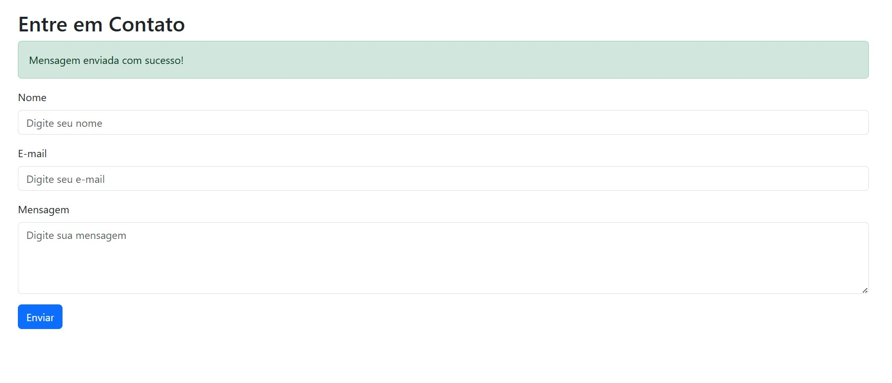

# 📬 Django-Mini-Project---Contact-Page-Ultima

## 📝 Sistema de Página de Contato em Django



---

## 🏅 Badges

- 📦 Tamanho do repositório:  
  

- 📄 Licença do projeto:  
  

---

## 📋 Índice / Table of Contents

- [📖 Descrição / Description](#📖-descrição--description)   
- [⚙️ Funcionalidades / Features](#⚙️-funcionalidades--features)  
- [🚀 Execução / Execution](#🚀-execução--execution)  
- [🌐 Acesso / Access](#🌐-acesso--access)  
- [🧰 Tecnologias / Technologies](#🧰-tecnologias--technologies)  
- [👨‍💻 Desenvolvedor / Developer](#👨‍💻-desenvolvedor--developer)  
- [📜 Licença / License](#📜-licença--license)  
- [🏁 Conclusão / Conclusion](#🏁-conclusão--conclusion)

---

## 📖 Descrição / Description

**PT:**  
Este mini projeto foi desenvolvido como parte dos exercícios da **Ultima.School**.  
O objetivo é criar uma **página de contato funcional em Django**, com formulário para envio de mensagens, salvamento no banco de dados e gerenciamento via painel administrativo.

O sistema permite:  
- Exibir uma página de contato acessível em `/contato/`  
- Formulário com campos de Nome, Email e Mensagem  
- Salvamento das mensagens no banco de dados  
- Visualização e gerenciamento das mensagens no **Django Admin**  

**EN:**  
This mini project was developed as part of the **Ultima.School** exercises.  
The goal is to build a **functional contact page in Django**, with a form to send messages, database persistence, and management via the Django admin panel.

The system allows:  
- Displaying a contact page at `/contato/`  
- Form with Name, Email, and Message fields  
- Saving messages into the database  
- Viewing and managing messages in the **Django Admin**  

---

## ⚙️ Funcionalidades / Features

| 🧩 Funcionalidade (PT)                          | 💡 Description (EN)                          |
|------------------------------------------------|----------------------------------------------|
| 📬 Página de contato em `/contato/`            | 📬 Contact page at `/contato/`               |
| 📝 Formulário com Nome, Email e Mensagem       | 📝 Form with Name, Email, and Message        |
| 💾 Salvamento no banco de dados                | 💾 Database persistence                      |
| 🔐 Gerenciamento via Django Admin              | 🔐 Management via Django Admin               |
| 🎨 Templates com Bootstrap                     | 🎨 Templates styled with Bootstrap           |

---

## 🚀 Execução / Execution

**PT-BR:**

1. Clone o repositório  
   ```bash
   git clone https://github.com/Rogerio5/Django-Mini-Project---Contact-Page-Ultima.git
   cd Django-Mini-Project---Contact-Page-Ultima

2. Crie um ambiente virtual e instale as dependências

   python -m venv venv
   venv\Scripts\activate   # Windows
   source venv/bin/activate  # Linux/Mac
   pip install -r requirements.txt

3. Execute as migrações

   python manage.py migrate

4. Crie um superusuário para acessar o admin

   python manage.py createsuperuser

5. Rode o servidor

   python manage.py runserver

6. Acesse no navegador:

   Página de contato: http://127.0.0.1:8000/contato/
   Painel admin: http://127.0.0.1:8000/admin/

EN:

1. Clone the repository
   bash

    git clone https://github.com/Rogerio5/Django-Mini-Project---Contact-Page-Ultima.git
    cd Django-Mini-Project---Contact-Page-Ultima
    
 2. Create a virtual environment and install dependencies
      
    bash
    python -m venv venv
    venv\Scripts\activate   # Windows
    source venv/bin/activate  # Linux/Mac
    pip install -r requirements.txt
    
 3. Run migrations
    
    bash
    python manage.py migrate

4. Create a superuser for admin access
    
    bash
    python manage.py createsuperuser
   
 5. Run the server
    
    bash
    python manage.py runserver

 6. Access in browser:
    
    Contact page: http://127.0.0.1:8000/contato/
    
    Admin panel: http://127.0.0.1:8000/admin/

---


## 🌐 Acesso / Access

- [🔗 Repositório GitHub / GitHub Repository](https://github.com/Rogerio5/Django-Mini-Project---Contact-Page-Ultima)

---

 ## 🧰 Tecnologias / Technologies

<p align="left">
  
  
  
  
  
</p>

---

## 👨‍💻 Desenvolvedor / Developer

- [Rogerio](https://github.com/Rogerio5)

---
   
## 📜 Licença / License

Este projeto está sob licença MIT. Para mais detalhes, veja o arquivo `LICENSE`.  

This project is under the MIT license. For more details, see the `LICENSE` file.

---

🏁 Conclusão / Conclusion

PT: O projeto Django-Mini-Project---Contact-Page-Ultima demonstra como é possível construir uma página de contato funcional em Django, integrando formulários, banco de dados e painel administrativo. Ele vai além de uma simples atividade, servindo como um mini projeto completo para portfólio.

EN: The Django-Mini-Project---Contact-Page-Ultima shows how to build a functional contact page in Django, integrating forms, database, and admin panel. It goes beyond a simple exercise, serving as a complete mini project for portfolio.
